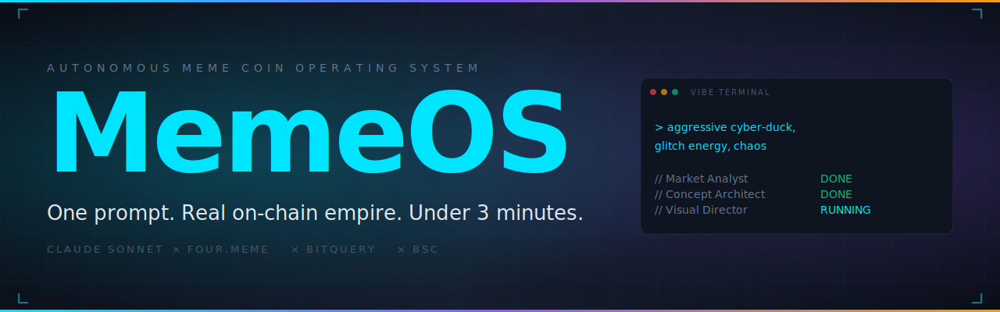

<p align="center">
  
</p>

<h1 align="center">MemeOS</h1>

<p align="center">
  <strong>One prompt. Real on-chain empire. Under 3 minutes.</strong><br/>
  <sub>An autonomous AI operating system that takes a single vibe and launches a full meme coin identity on BSC — live, on-chain, and shareable.</sub>
</p>

<p align="center">
  <a href="https://dorahacks.io/hackathon/fourmemeaisprint"></a>
  
  
  
  
</p>

---

## The Idea

Launching a meme coin is chaotic. You need a name, a story, character art, a community voice, a deployment path, and live monitoring — and the window where any of it matters is measured in hours.

**MemeOS compresses the entire pipeline into a single prompt.**

You describe a vibe. A swarm of five AI agents collaborates in real time — one analyzes the on-chain market, another extracts the personality, another designs the visuals, another writes the lore, and a fifth executes the deployment. In under three minutes, you have a live token on BSC via [four.meme](https://four.meme), a full narrative identity, a shareable empire page, and a downloadable passport card.

Everything you see is real. Real AI reasoning. Real on-chain transactions. Real market data. No mocks.

---

## What Makes It Different

MemeOS is not a launcher — it is an operating system for the entire lifecycle of a meme coin empire.

- **Full autonomous pipeline:** concept, visuals, narrative, deployment, and live monitoring happen in one flow. Not five separate tools you have to stitch together.
- **Adaptive agent swarm:** five specialized agents that actually debate each other. The Visual Director scores the Narrative Designer's output for visual coherence and requests revisions until the score clears a threshold.
- **Pre-launch intelligence:** the Market Analyst queries Bitquery for current top performers on four.meme before any other agent runs. Every downstream decision is grounded in what is actually working on-chain right now.
- **Virality score:** before you deploy, Claude produces a 0-100 viral potential score with a breakdown across naming, visual, narrative, and timing — plus risk flags you can act on.
- **Live empire pages:** every deployed token gets a public, shareable page at `/empire/<address>` with full Open Graph cards, live bonding curve, trade feed, and holder data pulled directly from BSC RPC.
- **Remix loop:** any token in the Global Deploy Feed can be remixed with one click. The original vibe flows into the vibe terminal pre-filled, creating a viral propagation mechanic between users.
- **Six personality modes:** Balanced, Aggressive, Zen, Chaotic, Degen, Aesthetic. Each rewires all five agents' system prompts. Same vibe, wildly different outputs.
- **Agent voice:** an opt-in Web Speech API integration that makes each agent literally narrate its status transitions during the demo. Each agent has a distinct pitch and rate.
- **Meme Passport:** a server-rendered PNG card with the token identity, optimized for Twitter/X sharing.

---

## How It Works

```
                    +----------------+
                    |  VIBE PROMPT   |
                    +--------+-------+
                             |
              +--------------+--------------+
              |                             |
              v                             v
    +-------------------+        +---------------------+
    |  MARKET ANALYST   |        |   IMAGE PRE-GEN     |
    |  Bitquery intel   |        |  Pollinations.ai    |
    +---------+---------+        +----------+----------+
              |                              |
              v                              |
    +-------------------+                    |
    | CONCEPT ARCHITECT |                    |
    |  names, audience  |                    |
    +---------+---------+                    |
              |                              |
              +----> VISUAL DIRECTOR <-------+
              |              |
              |              v
              v       +-------------+
       NARRATIVE <--- |  CRITIQUE   |
       DESIGNER      |   LOOP      |
              |       +-------------+
              v
    +--------------------+
    |   USER REVIEW      |
    |  (edit, pick,      |
    |   approve)         |
    +---------+----------+
              |
              v
    +--------------------+         +----------------+
    | LAUNCH COMMANDER   |-------->|  four.meme     |
    |  deploy to BSC     |         |  TokenManager2 |
    +---------+----------+         +----------------+
              |
              v
    +--------------------+         +----------------+
    |    EMPIRE MODE     |<--------|  BSC RPC       |
    |  live monitoring   |         |  Bitquery      |
    +--------------------+         +----------------+
```

After the agent swarm finishes, the user lands on a **Review & Approve** screen where they can:

- Pick from three AI-generated names or type their own
- Edit the lore, taglines, and ticker
- Choose between two AI-generated images or upload their own
- See the virality score and risk flags before committing
- Share to X with a single click

Only then does the **Launch Commander** push the transaction through the [four.meme Agent Skill](https://github.com/four-meme-community/four-meme-ai).

---

## The Agent Swarm

| Agent | Role | Output |
|---|---|---|
| **Market Analyst** | Queries Bitquery for top-performing four.meme tokens in the last 24h, analyzes naming patterns and bonding curve completion rates. | Market intelligence report |
| **Concept Architect** | Takes the raw vibe + market intel and extracts personality, audience, narrative hooks, three name candidates with reasoning. | Structured concept brief |
| **Visual Director** | Produces a detailed image generation prompt, generates two character art variants via Pollinations.ai, and scores the narrative for visual coherence. | Character art + critique score |
| **Narrative Designer** | Writes origin lore, three billboard-worthy taglines, five ready-to-post tweets, and a community welcome pack. Revises based on Visual Director feedback. | Complete narrative package |
| **Launch Commander** | Assembles the final payload and executes the real on-chain deployment through four.meme. Extracts the token address from the BSC transaction receipt. | Deployed token with tx hash |

### Critique Loop

The Visual Director scores the Narrative Designer's output on a 1-10 visual coherence scale. If the score is below 7, the Narrative Designer revises based on specific feedback. Up to two revision rounds. The debate streams live on the dashboard so users can watch the agents iterate.

---

## Tech Stack

| Layer | Technology |
|---|---|
| Framework | Next.js 14 (App Router) |
| Styling | Tailwind CSS 3, Framer Motion |
| 3D Background | Three.js + postprocessing (Hyperspeed WebGL) |
| AI Reasoning | Claude Sonnet via Anthropic SDK (with prompt caching) |
| Image Generation | Pollinations.ai (Flux model) |
| On-chain Deploy | [four.meme Agent Skill](https://github.com/four-meme-community/four-meme-ai) |
| Market Data (pre-launch) | Bitquery GraphQL |
| Live Data (post-launch) | BSC RPC via viem (with fallback endpoints) |
| Passport Rendering | satori + @resvg/resvg-js |
| State Management | Zustand |
| Voice | Web Speech API (speechSynthesis) |
| Persistent Store | File-based JSON (`.data/deploys.json`) |

---

## Getting Started

### Prerequisites

- Node.js 20+
- A BSC wallet with a small amount of BNB for gas (~0.001 BNB per token creation)
- An Anthropic API key
- A Bitquery access token (free tier is enough)

### Installation

```bash
git clone <your-fork>
cd memeos
cp .env.local.example .env.local
# Fill in your keys — see below
npm install
npm run dev
```

Open [http://localhost:3000](http://localhost:3000).

### Environment Variables

```env
ANTHROPIC_API_KEY=sk-ant-...          # Claude API key
PRIVATE_KEY=0x...                      # BSC wallet private key (hex, with or without 0x)
BSC_RPC_URL=https://bsc-dataseed.binance.org
BITQUERY_API_KEY=ory_at_...            # Bitquery GraphQL access token
```

### Where to get the keys

- **Anthropic:** [console.anthropic.com](https://console.anthropic.com)
- **Bitquery:** [account.bitquery.io/user/api_v2/api_keys](https://account.bitquery.io/user/api_v2/api_keys) — sign up and generate an access token. The free tier covers typical usage.
- **BSC Wallet:** export the private key from any wallet (MetaMask, Rabby, etc.) or generate a fresh one via `node -e "console.log('0x'+require('crypto').randomBytes(32).toString('hex'))"`. Fund it with a small amount of BNB.

### Useful Commands

```bash
npm run dev      # Start the local dev server on :3000
npm run build    # Production build
npm start        # Serve the production build
```

---

## Project Structure

```
memeos/
├── app/
│   ├── page.tsx                 # Landing page (vibe input, deploy feed)
│   ├── layout.tsx               # Root layout
│   ├── icon.svg                 # Favicon
│   ├── dashboard/               # Build -> Review -> Deploy -> Empire flow
│   ├── empire/[address]/        # Public shareable token pages
│   ├── leaderboard/             # Hall of Fame
│   ├── how-it-works/            # Marketing / explainer page
│   └── api/
│       ├── swarm/               # SSE: runs the full agent swarm
│       ├── deploy/              # SSE: executes on-chain deployment
│       ├── virality/            # POST: viral score analysis
│       ├── market/live/         # SSE: live empire monitoring (BSC RPC)
│       ├── history/global/      # GET: global deploy feed
│       ├── leaderboard/         # GET: ranked tokens
│       ├── passport/            # GET: server-rendered PNG card
│       └── upload/              # POST: user image upload
├── components/
│   ├── landing/                 # Hero, vibe input, personality picker, deploy feed
│   ├── dashboard/                # Agent stream, review panel, virality score
│   ├── empire/                   # Live data panels
│   ├── passport/                 # Meme Passport card
│   └── ui/                       # Glass panel, glow button, voice toggle, Hyperspeed
├── lib/
│   ├── store.ts                  # Zustand global store
│   ├── hooks.ts                  # useSwarmGenerate, useDeployToken
│   ├── voice.ts                  # Web Speech API integration
│   ├── history.ts                # Local deploy history
│   └── utils.ts
├── src/
│   ├── orchestrator.ts           # MemeOS class — generate() and deploy()
│   ├── agents/                   # Five agent classes + BaseAgent
│   ├── personality/modes.ts      # 6 personality modes (Balanced, Aggressive, Zen, etc.)
│   ├── bitquery/                 # GraphQL client + queries
│   ├── bsc/rpc.ts                # viem-based BSC RPC with fallback endpoints
│   ├── fourmeme/client.ts        # four.meme Agent Skill wrapper
│   ├── image/generator.ts        # Pollinations.ai client
│   ├── storage/deploys.ts        # File-based persistence
│   └── types.ts
└── .data/
    └── deploys.json              # Persisted empire registry
```

---

## API Surface

All endpoints are under `/api`. The SSE routes stream server-sent events; the rest return JSON.

| Route | Method | Purpose |
|---|---|---|
| `/api/swarm` | `POST` | Streams agent events, returns generated concept + narrative + visuals |
| `/api/deploy` | `POST` | Streams launch events, executes the four.meme deployment |
| `/api/virality` | `POST` | Scores the generated concept on viral potential |
| `/api/market/live` | `GET` | SSE stream of live trades, bonding curve, holders |
| `/api/history/global` | `GET` | Returns the global deploy registry |
| `/api/leaderboard` | `GET` | Returns tokens ranked by `?sort=virality\|bonding\|recent` |
| `/api/passport` | `GET` | Returns a PNG passport card for the token |
| `/api/upload` | `POST` | Accepts a user-uploaded image for the token |

---

## Design Decisions Worth Calling Out

**File-based persistence over a database.** For a hackathon build, a JSON file in `.data/deploys.json` is reliable, zero-setup, and fast. Every successful deploy server-side appends to the file. The Global Deploy Feed reads from it. For production, swap in Vercel KV or Upstash Redis.

**BSC RPC over third-party indexers for live data.** Bitquery's free tier runs out of points quickly. The Empire Mode uses viem with a fallback chain of five public BSC RPC endpoints (Binance, DefiBit, NiniCoin, PublicNode, LlamaRPC) and intelligent block-range chunking to stay within free-tier limits.

**Shell script for the four.meme CLI.** The `@four-meme/four-meme-ai` CLI is shell-spawned via `bash` to avoid Node's `execFile` argument escaping issues with narrative content that contains quotes, newlines, and special characters.

**Token address extraction.** When the CLI only returns a transaction hash, the `FourMemeClient` polls the BSC transaction receipt via JSON-RPC and extracts the token address from the mint event log (four.meme tokens end in `4444`).

**Image strategy.** Both images are generated in parallel the moment the user clicks Launch Sequence. They run during the agent phase, so by the time the review panel loads, both variants are already downloaded locally — no lazy loading, no broken image icons.

---

## Future / Phase 2

The following features are roadmapped, not built. Honest about scope.

- **Guardian Agents:** post-launch autonomous agents that monitor the token, respond to community sentiment, generate follow-up lore chapters, and suggest parameter tweaks as the bonding curve matures.
- **Monte Carlo Virality Simulator:** run 100+ simulated 24h/7d scenarios before deploy using historical Bitquery data, producing probability distributions rather than a single score.
- **Self-Improving Memory Loop:** opt-in, anonymized performance data from deployed tokens feeds back into the Genome store. The system gets sharper with every empire.
- **Multi-chain Support:** Solana (pump.fun), Ethereum (Clanker), Base. Same agent flow, different deployment primitives.
- **Token Battle Arena:** two vibes compete head-to-head, both get generated, the user picks the winner, only the winner deploys.
- **Swarm SDK:** extract the orchestrator into a standalone `memeos-sdk` npm package so third-party apps can embed the agent pipeline with a single function call.
- **Discord + Twitter bots:** `/memeos <vibe>` in Discord or `@memeos launch <vibe>` on X. Bot deploys and replies with the empire URL.
- **Persistent cloud store:** migrate the file-based store to Vercel KV / Upstash Redis for multi-instance deployment.

---

## Hackathon

MemeOS was built for the [Four.Meme AI Sprint Hackathon](https://dorahacks.io/hackathon/fourmemeaisprint) — April 2026. $50,000 prize pool, global online, BNB Chain ecosystem.

Judged on Innovation (30%), Technical Implementation (30%), Practical Value (20%), Presentation (20%). MemeOS is architected to score across all four.

---

## License

MIT

---

<p align="center">
  <sub>Built with Claude · Powered by four.meme · Deployed on BNB Chain</sub>
</p>
